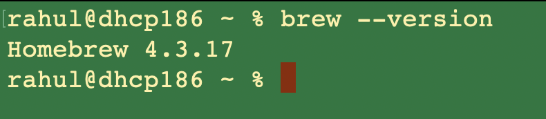
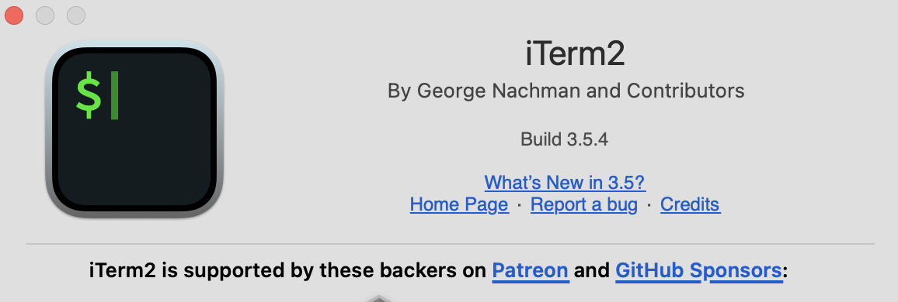
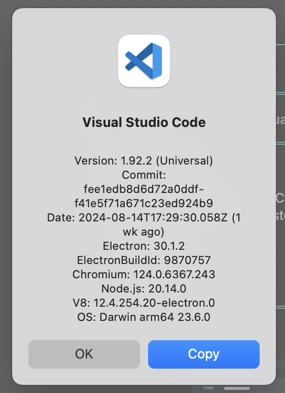

## Package Manager - Bash

## Installation of a Modern Shell - zsh and ssh

## Installation of a Modern Terminal - iTerm2

## Install IDE editor with native version control support - VSCode

## Install Git Client for Version Control

